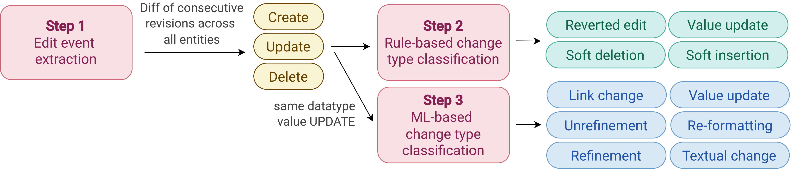

# ML-based Change Type Classification in Wikidata

This repository contains code and artifacts for classifying Wikidata value changes across multiple datatypes (e.g., `quantity`, `time`, `text`, `entity`, and `globecoordinate`).  
It includes LLM baseline classification, ML-based classification, and analysis scripts.

Change Type classification is a 3-step process, where the first 2 steps are performed during change extraction (performed using [WiDiff](https://anonymous.4open.science/r/WiDiff-DC11/README.md)).

This tool assumes a database populated by [WiDiff](https://anonymous.4open.science/r/WiDiff-DC11/README.md) exists, and that change extraction was performed with *feature_extraction: true* and *re_interpretation: true* (see `set_up.yml` of **WiDiff**).

This README is structured as follows:
- [Repository structure](#repository-structure): presents the repository structure
- [Change Types](#change-types): presents the [change type taxonomy](#change-type-taxonomy) and classification framework
- [Datatype groupings](#datatype-groupings): explains the data type grouping performed
- [Reproduce results](#reproduce-results): provides links to model, features, and classification results of our ML classifier for reproducibility
- [Classification](#classification): explains how to train and run our ML-based classification, and describes how to run the LLM baseline.
- [Analysis](#analysis): explains how to run analysis scripts to obtain plots in the paper and analysis results (e.g., using change types).
- [Notes on labeling of training dataset](#notes-on-labeling-of-training-dataset): explains some edge cases and the decision taken during the labeling process.
---

## Repository Structure
```text
wikidata-change-analysis/
├── main.py                         # Main entrypoint for train/evaluate/classify
├── set_up.yml                      # Configuration
├── requirements.txt                # Python dependencies
├── notebook.ipynb                  # Ad-hoc analysis notebook
│
├── src/
│   ├── pipeline.py                 # Orchestrates classifier init, train, eval, run
│   │
│   ├── classifiers/
│   │   ├── base_classifier.py      # Shared classifier interface
│   │   ├── ml/
│   │   │   ├── ml_classifier.py    # Train & Evaluate ML classifier
│   │   │   ├── ml_features.py      # Feature extraction
│   │   │   ├── features/           # Feature columns, scalers, training dataset features
│   │   │   └── training_info/      # Saved model training artifacts
│   │   └── llm/
│   │       └── llm_classifier.py   # implements calls for LLM classification
│   │
│   ├── config/
│   │   ├── db_config.json              # DB params for connection
│   │   ├── ml_classifier_config.json   # Configuration params for ML classification
│   │   ├── llm_classifier_config.json  # Configuration params for LLM classification
│   │   └── models_config.json
│   │
│   ├── sql_runner/
│   │   └── sql_runner.py           # SQL execution layer
│   │
│   ├── utils/
│   │   ├── const.py
│   │   └── utils.py
│   │
│   ├── analysis/
│   │   ├── scripts/
│   │   │   └── classification_analysis.py # analysis scripts
│   │   ├── sql/                    # Analysis SQL queries
│   │   └── results/                # Generated analysis outputs (CSV)
│   │
│   └── results/
│       ├── classification/         # Classification outputs of LLM
│       └── training/               # Model selection/training summaries
│
├── transitive_closures/            # Cached transitive closure data (for feature extraction)
├── gold_standard/                  # Gold-standard dataset + Labeling rules
└── logs/                           # Runtime logs
```
---

## Change Classification Framework and Change Type taxonomy

This section our change classification framework and change taxonmy.

As shown in the picture below, our change classification framework is composed of 3 steps. The first step classifies edit events which are the basic edits a user can perform on Wikidata entities. In particular, this step classifies (1) statement (and associated rank) insertion, update and deletion, (2) qualifier insertion and deletion, and (3) reference insertion and deletion.
In Step 2 we re-interpret some edit events (e.g., the upgrade of a rank can be classified as soft insertion), tag reverted edits (reverted edits within 4 weeks) and value updates between values of different datatypes (e.g., quantity to string) or from "no value" or "some value" to a concrete value.
Note that classification for Step 1 and 2 is performed in WiDiff by enabling *re-interpretation: true*.

In Step 3, we refine value updates between values of the same datatype and classify them into refinement, unrefinement, re-formatting, textual change, link change, or value update (for complete changes between values).



Next, we present the definitions of the different change types.

### Change Type Taxonomy

#### Statement Addition
A new statement is added to an entity. *Example:* for the entity Uruguay (Q77) the statement <Uruguay, capital, Montevideo>[↗](https://www.wikidata.org/w/index.php?title=Q77&diff=next&oldid=5443901) was added.

#### Reference/Qualifier Addition
A reference or qualifier is added to an existing statement. *Example:* The qualifier {end time: 2014} was added to <Luis Suárez, member of sports team, Liverpool F.C.>[↗](https://www.wikidata.org/w/index.php?title=Q26517&diff=prev&oldid=318347070), and the reference {imported from Wikimedia project: Italian Wikipedia} was added to <Luis Suárez, mass, 85>[↗](https://www.wikidata.org/w/index.php?title=Q26517&diff=prev&oldid=355943840).

#### Soft Insertion
A statement's rank is changed from *normal* or *deprecated* to *preferred*, indicating that it represents the most current or accurate value among multiple statements for the same property.
*Example:* <Luis Suárez, given name, Luis> rank was promoted to *preferred*[↗](https://www.wikidata.org/w/index.php?title=Q26517&diff=prev&oldid=889792976), when a second statement <Luis Suárez, given name, Alberto> was added for the same property[↗](https://www.wikidata.org/w/index.php?title=Q26517&diff=next&oldid=889792976).

#### Statement Deletion
A statement is permanently removed from an entity.
*Example:* <Frank van Pamelen, image, Lezing Frank van Pamelen over De Vliegende Hollander.webm>[↗](https://www.wikidata.org/w/index.php?title=Q21281434&diff=next&oldid=1328934396) was deleted after the correct statement (using the *video* property) was added in the prior revision[↗](https://www.wikidata.org/w/index.php?title=Q21281434&diff=prev&oldid=1328934396).

#### Reference/Qualifier Deletion
A reference or qualifier is removed from an existing statement. *Example:* The reference {imported from Wikimedia project: Italian Wikipedia} was removed from <Luis Suárez, mass, 85>[↗](https://www.wikidata.org/w/index.php?title=Q26517&diff=prev&oldid=759983195) and replaced by a more precise one. Similarly, the qualifier {end time: 2020} was removed from <Luis Suárez, member of sports team, Futbol Club Barcelona> and replaced by {end time: September 2020}[↗](https://www.wikidata.org/w/index.php?title=Q26517&diff=prev&oldid=1282785821).

#### Soft Deletion
A statement is logically invalidated without being removed, either by setting its rank to *deprecated* or by adding an *end time (P582)* qualifier (in practice, we also consider the properties *earliest end date (P8554)*, *latest end date (P12506)*, and *end period (P3416)*).

**Examples:**
- <X, native label, Twitter> was deprecated [↗](https://www.wikidata.org/w/index.php?title=Q918&diff=next&oldid=1941896530) in favour of <X, native label, X>[↗](https://www.wikidata.org/w/index.php?title=Q918&diff=prev&oldid=1941896530)
- {end time: July 2023} was added to <X, official name, Twitter>[↗](https://www.wikidata.org/w/index.php?title=Q918&diff=prev&oldid=1942019219) to mark the renaming of the social network.

#### Value Update
A property value is replaced with a semantically different value, altering the statement's meaning. For time, quantity, and globecoordinate values, we also consider sign changes (e.g., -1 -> +1(https://www.wikidata.org/w/index.php?title=Q801294&diff=prev&oldid=110422583)) as value updates, since switching the sign alters the meaning of the value. 
**Examples:**
- *Entity:* Agnosticism (Q288928) -> Islam (Q432)[↗](https://www.wikidata.org/w/index.php?title=334871&diff=prev&oldid=1035395644)
- *Text:* "a country in North America" -> "a country in Central America"[↗](https://www.wikidata.org/w/index.php?title=242&diff=prev&oldid=3747808)
- *Quantity:* +1684527 -> +1719070[↗](https://www.wikidata.org/w/index.php?title=254232&diff=prev&oldid=1028093806) or -1 -> +1 [↗](https://www.wikidata.org/w/index.php?title=Q801294&diff=prev&oldid=110422583)
- *Globe coordinate:* {"latitude": -3.09771, "longitude": -226.98051}{"latitude": -2.8114, "longitude": 118.169}[↗](https://www.wikidata.org/w/index.php?title=26727&diff=prev&oldid=135136435).
- *Time:* -5-00-00 -> +1951-09-25[↗](https://www.wikidata.org/w/index.php?title=210447&diff=prev&oldid=1070077246) or +100-00-00 -> -100-00-00[↗](https://www.wikidata.org/w/index.php?title=Q801294&diff=prev&oldid=663123864), +1764-01-01 -> +1764-00-00[↗](https://www.wikidata.org/w/index.php?title=Q801294&diff=prev&oldid=1574340120)

#### Re-formatting
A property value’s representation is modified at the surface-level, without altering its underlying meaning. For text values, re-formatting covers changes to visual presentation, such as spacing, capitalization, hyphenation, and other typographical elements. For quantity, re-formatting covers changes in numerical precision that do not alter the value (e.g., adding or removing trailing zeros).
**Examples:**
- *Text:* "british series" -> "British series"[↗](https://www.wikidata.org/w/index.php?title=111218853&diff=prev&oldid=2181757886), "American hacker & author" -> "American hacker and author"[↗](https://www.wikidata.org/w/index.php?title=7555&diff=prev&oldid=1879171568), "The seventh Secretary-General of the United Nations" -> "7th Secretary-General of the United Nations"[↗](https://www.wikidata.org/w/index.php?title=1254&diff=prev&oldid=494544)
- *Quantity:* +4.0 -> +4[↗](https://www.wikidata.org/w/index.php?title=Q801294&diff=prev&oldid=109984021) or +98 -> +98.0[↗](https://www.wikidata.org/w/index.php?title=Q801294&diff=prev&oldid=107182680)

#### Textual Change
A property value of type text is modified to correct or introduce language errors, such as spelling, typos, or grammar, without altering sentence structure or the statement's meaning.
**Examples:**
- "country in southeastern Europe" -> "Country in Southeast Europe"[↗](https://www.wikidata.org/w/index.php?title=Q225&diff=prev&oldid=1678150592)
- "American acterss" -> "American actress"[↗](https://www.wikidata.org/w/index.php?title=Q801294&diff=prev&oldid=143695424)
- "German neuroloigst" -> "German neurologist"[↗](https://www.wikidata.org/w/index.php?title=61670\&diff=prev\&oldid=1294776951)
- "country in southeastern Europe" -> "Country in Southeast Europe"[↗](https://www.wikidata.org/w/index.php?title=Q225\&diff=prev\&oldid=1678150592)
- "Province of Lecce" -> "Pprovince of Lecce"[↗](https://www.wikidata.org/w/index.php?title=16197\&diff=prev\&oldid=2026395311)
- "sovereignt" -> "sovereignty"[↗](https://www.wikidata.org/w/index.php?title=42008&diff=prev&oldid=1288335214)
- "A mountain in Beijing" -> "mountain in Beijing"[↗](https://www.wikidata.org/w/index.php?title=111218927&diff=prev&oldid=2306840798)

#### Link Change
An entity reference is replaced by another one with a similar or identical label but representing a different concept.
**Examples:**
- Queen Victoria (Q235199) -> Victoria (Q9439)[↗](https://www.wikidata.org/w/index.php?title=20875&diff=prev&oldid=6084088)
- historical Jesus (Q51666) -> Jesus (Q225149)[↗](https://www.wikidata.org/w/index.php?title=345&diff=prev&oldid=6617845)
- McLaren F1 (Q849607) <-> McLaren (Q172030)[↗](https://www.wikidata.org/w/index.php?title=10490&diff=prev&oldid=6213912)

#### Refinement / Unrefinement
A property value is replaced by a more (refinement) or less (unrefinement) precise value, without changing the statement's meaning. A refinement may add contextual information, rephrase a text to convey the same meaning more clearly, increase numerical precision, or provide a more specific classification. Analogously, an unrefinement may remove contextual information, decrease numerical precision, or generalize to a broader classification. In both cases, the new value remains semantically compatible with the old one.
**Examples:**
- *Entity:* business (Q4830453) <-> automobile manufacturer (Q786820)[↗](https://www.wikidata.org/w/index.php?title=257815&diff=prev&oldid=1316485355)
- *Text:* "city" <-> "city in South Korea"[↗](https://www.wikidata.org/w/index.php?title=42131&diff=prev&oldid=369720776)
- *Quantity:* +222 <-> +222.4[↗](https://www.wikidata.org/w/index.php?title=192789&diff=prev&oldid=986978112)
- *Globe coordinate:* {"latitude": 14, "longitude": 121.917} <-> {"latitude": 14, "longitude": 121.91666666667} [↗](https://www.wikidata.org/w/index.php?title=103807&diff=prev&oldid=89413888)
- *Time:* +1910-02-10 <-> +1910-00-00[↗](https://www.wikidata.org/w/index.php?title=Q3895839&diff=prev&oldid=1431694434)

#### Reverted Edit
A change is considered reverted when a subsequent edit restores a previous value of a property.
*Example:* "44th President of the United States of America" -> "Worst president ever" for Barack Obama (Q76) [↗](https://www.wikidata.org/w/index.php?title=Q76&diff=prev&oldid=7375872) was reverted in a subsequent revision.

The following table presents a summary of the change types, indicating which ones are reversible, their granularity and classification step.

| **Category** | **Change Type** | **Reversible** | **Granularity** | **Classification Step** |
|:---|:---|:---:|:---:|:---:|
| **Create** | Reference/Qualifier insertion | | Statement | 1 |
| | Statement insertion | x | Entity | 1 |
| | Soft insertion | x | Statement | 2 |
| **Update** | Link change* | x | Value | 3 |
| | Re-formatting* | x | Value | 3 |
| | Refinement | x | Value | 3 |
| | Unrefinement | x | Value | 3 |
| | Textual change* | x | Value | 3 |
| | Value update | x | Statement | 2 & 3 |
| **Delete** | Reference/Qualifier deletion | | Statement | 1 |
| | Statement deletion | x | Entity | 1 |
| | Soft deletion | x | Statement | 2 |

\* *Link change* applies to entity values; *Re-formatting* to text, time, globecoordinate, and quantity values; *Textual change* to text values only.

--- 

## Datatype groupings
Additionally, since Wikidata defines 18 datatypes, some of which can have added "metadata" (e.g., a value of datatype quantity is accompanied by a unit, lower and upper bound), we group Wikidata's datatypes by their underlying JSON representation. For example, Wikidata's quantity datatype maps directly to a JSON quantity type, while geo-shape is represented as a JSON string. Therefore, we end up with the following datatypes: string, quantity, time, entity, globecoordinate.
We also include a new "datatype" named "unknown-values" for the values "somevalue" and "novalue".

In the following we show the groupings for "string" and "entity":
STRING_TYPES = ['monolingualtext', 'string', 'external-id', 'url', 'commonsMedia', 'geo-shape', 'tabular-data', 'math', 'musical-notation', 'unknown-values']

ENTITY_TYPES = ['wikibase-item', 'wikibase-entityid', 'wikibase-property', 'wikibase-lexeme', 'wikibase-sense', 'wikibase-form', 'entity-schema']

---

## Reproduce results

We provide the trained models and features in [Wikidata Change Classification Trained Models and Features](https://doi.org/10.5281/zenodo.19788996).

To re-use this resources, unzip files and put in the following folders:
- features.zip -> src/classifiers/ml/features/ (contains features calculated for training dataser)
- training_info.zip -> src/classifiers/ml/training_info/ (contains different trained models (.pkl files) evaluated)
- trained_model.zip -> src/results/training/ (contains the best model used for classification of all of Wikidata edit history + metrics)
- models_config.json -> src/config/models_config.json (contains the best parameters for the different algorithms obtained via grid search).

Additionally, we provide the training dataset at [Labeled Dataset of Wikidata Edit History Changes](https://zenodo.org/records/19764415). Download both files, put them in a folder *gold_standard/* at the root of the project. 

Follow the steps below for classification or traininig.

---

## Classification

**Note:** The classification uses the training_info.pkl stored in *src/results/training/*. By default, this folder stores the best model (the one with highest F1 across all tasks). To use another model, copy its *training_info.pkl* from *src/classifiers/ml/training_info/* to *src/results/training/* and rename with *best_model_training_info.pkl*.

Example: If you want to use random forest, then *src/classifiers/ml/training_info/training_info_random_forest.pkl* needs to be moved to *src/results/training/* and renamed accordingly.

### ML classification
1. Set database parameters in a .json file and set the path to this config file in `set_up.yml` under *config* - *database_config_path*

````bash
{
    "user": "username",
    "password": "password",
    "dbname": "database_name",
    "port": 5432,
    "host": "localhost"
}
````

2. Set *classifier_type* to *ml* in `set_up.yml` and the respective step (train, evaluate, classify) to be ran in *classification_ml*. For the classify step, set `table_prefix` (can be one of: '_less', '_sa', '_ao', '' - See entity filters in change extraction tool - WiDiff) and `max_batches` (maximum number of batches of changes to classify, if this is None then it classifies everything) accordingly.
3. Run `python3 main.py`.

*Note:* For classification of all changes in the DB (step *classification_ml - classify: true* in `set_up.yml`), change extraction should have been performed with *feature_extraction: true*, and the script `compute_remaining_features.py` should have been ran. Refer to [WiDiff](https://anonymous.4open.science/r/WiDiff-DC11/README.md) for this last step (Section *Compute remaining features* in README).

#### Training

For training, the transitive closure cache must be created beforehand. Refer to [WiDiff](https://anonymous.4open.science/r/WiDiff-DC11/README.md) for transitive closure extraction and cache creation (Section *Transitive closure cachce creation* in README). The `transitive_closure_cache.pkl` file should be inside a directory called `transitive_closures` inside `/src/classifiers/ml/`. *Note:* The .csv files for the cache creation are provided in [WiDiff: Wikidata Entity Labels, Descriptions and Alias, Types (P31 and P279), and Transitive Closures (October 2025)](https://doi.org/10.5281/zenodo.19771721).

**Configuration**

Training is performed doing 5-fold cross validation. The number of folds can be changed in *config/ml_classifier_config.json*

Additionally, since we want to guarantee that every change has a label assigned and multi-label classifiers return probabilities for each class, we assign all labels to a change where prob >= 0.5, If no probability reaches this threshold, we take the one with the maximum probability. This threshold can be modified in *config/ml_classifier_config.json*.

Finally, we use *random_state = 42* so results are reproducible (also set in *config/ml_classifier_config.json*).

During training we use *grid search* to find the best parameters for the different models. This information is stored in *src/config/models_config.json*

**Output**

Training outputs *training_info_<model_name>.pkl* files with the following structure:

`````bash
    {
        "datatype": {
            'results_folds': [], # results per fold
            'micro_averages': {
                'datatype': {
                    'precision': float,
                    'recall': float,
                    'accuracy': float,
                    'f1': float
                }
            } 
    }

    # results per fold:
    {
        'classifier': string, # kn, xgboost, random_forest, gradient_boosting
        'fold': int, # 0-4
        'metrics_results': { # macro average
            'label': { 
                'precision': float,
                'recall': float,
                'accuracy': float,
                'f1': float
            }
        },
        'model': clf, # if the base_model doesn't support MultiOutput classification, we send it through MultiOutputClassifier. If not base_model == model
        'base_model': model, # base model (GradientBoosting, RandomForest, XGBoost, KNN)
        'features': feature_cols, 
        'multi_label_binarizer': label_binarizer,
        'best_params': best_params_from_grid_search
    }
`````

**Note:** The `notebook.ipynb` provides code for plotting comparison between different classifiers (Traditional and LLM) from their *training_info.pkl* 

---

### LLM baseline
1. Configure LLM in `config/llm_classifier_config.json`. To use Qwen 3.5 (FP8 quantized), run the following command in the background:
```bash
vllm serve Qwen/Qwen3.5-35B-A3B-FP8 \
    --port 8001 \
    --tensor-parallel-size 2 \
    --max-model-len 4096 \
    --reasoning-parser qwen3 \
    --language-model-only
```
and set the corresponding `base_url` in the configuration file (`src/config/llm_classifier.json`). 
2. Set *classifier_type* to *llm* in `set_up.yml`. 
3. Run `python3 main.py`. This classifies changes on the labeled dataset (`gold_standard/gold_standard.csv`)

*Note:* We used 2 40GB VRAM GPUs and that's why --tensor-parallel-size 2 is enabled. If running on a single GPU, then this should be removed

---

## Analysis
The script `src/analysis/classification_analisys.py` generates plots for the classified changes. 
Each function corresponds to a specific analysis and can be run independently by toggling the corresponding `execute` flag in `setup.yml`. When `reload_data: true`, the function executes the underlying SQL query and caches the results as a CSV; subsequent runs load from the cache instead of re-querying the database, as long as `reload_data: false`.

Available analysis:

| Function | Description |
|---|---|
| `distribution_change_types` | Distribution of change types overall, per datatype, and per user type (Figures in the paper) |
| `change_types_overtime` | Evolution of change types over time, overall and per datatype |
| `soft_deletion_vs_hard_deletion` | Comparison of soft and hard deletion counts per entity |
| `reverted_edits` | Reverted edits over time broken down by user type |
| `prop_reverts_overtime` | Average time until reversion per property |

Output figures are saved to `results/classification_analysis/figures/`.

To run the analysis, execute from root:
````bash
python3 -m src.analysis.scripts.classification_analysis
````

### Edit patterns
- To reproduce results for `quantity unrefinements`, run the sql query: */src/analysis/sql/quantity_unrefinement.sql*
- To reproduce results for `time unrefinements`, run the sql queries in: */src/analysis/sql/time_refinement.sql*
    - The first query counts how many refinements add just a month, how many just a day and how many add the month and day at the same time.
    - The second query counts how many time values where added with just a year
- To reproduce results for `globecoordinate refinement` ( DMS to decimal conversion + comment check) run the sql queries in: */src/analysis/sql/globecoordinate_refinement.sql*
    - The first query applies to latitude changes and counts how many refinements match that the new value is the DMS to DD conversion of the value in the comment.
    - The second query applies to longitude changes, counts the same thing.
- To reproduce results for `text refinement` run the sql queries in: */src/analysis/sql/text_refinement.sql*
    - The first query counts number of refinements
    - The second query returns properties that suffer refinements, ordered by their number of refinements in descending order
    - The third query returns the number of distinct entities that suffer a change to their label or description
- To reproduce results for `user distribution for entity changes`, run the queries in: *dist_change_types_per_user.sql*. This queries create a table that contains for each ML-classified change type and user type, the number of non reverted edits and number of reverted edits

### Using change types
- To obtain the reverts of *date of birth (P569)* for which the reason is a lack of surce, run the queries in: */src/analysis/sql/time_refinements_reverted_lack_of_source.sql*
    - The first query returns the number of refinements for the property P569
    - The second query returns the number of refinements that are reverted and the reversion comment contains the word *non-WP source(s)*
- To obtain oscillations between refinements and unrefinements run the query in: */src/analysis/sql/entity_refinement_unrefinement_oscillations.sql*

## Notes on labeling of training dataset
- When there's a sign change and a refinement/unrefinement in a quantity or globecoordinate value, we tag the change with *property_value_update*. The reason behind this is that refinement is exclusively for precision changes; however, as soon as there's a sign change, the meaning of the value changes completely, therefore property_value_update > refinement / unrefinement.

- Example: {"latitude": 8.5041666666667, "longitude": 125.9975}  -> {"latitude": -8.504167, "longitude": 125.9975} [↗](https://www.wikidata.org/w/index.php?title=Q100870460&diff=prev&oldid=2318611200)